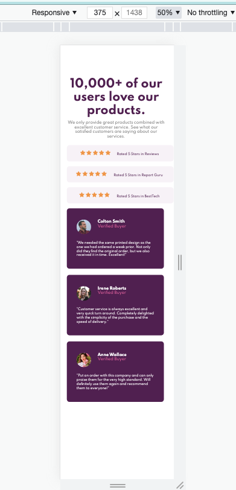
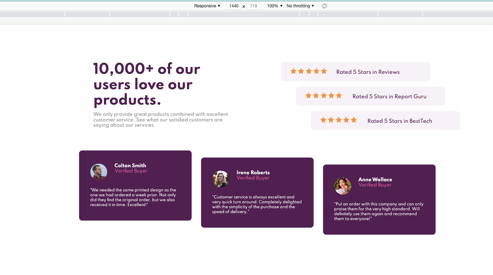

# Frontend Mentor - Social proof section solution

This is a solution to the [Social proof section challenge on Frontend Mentor](https://www.frontendmentor.io/challenges/social-proof-section-6e0qTv_bA). Frontend Mentor challenges help you improve your coding skills by building realistic projects.

## Table of contents

- [Overview](#overview)
  - [The challenge](#the-challenge)
  - [Final Outcome](#final-outcome)
  - [Links](#links)
- [My process](#my-process)
  - [Built with](#built-with)
  - [What I learned](#what-i-learned)
- [Author](#author)

## Overview

### The challenge

Users should be able to:

- View the optimal layout for the section depending on their device's screen size

### Final Outcome

Screen_Mobile_375  

Screen_Laptop_1440  

### Links

- Solution URL: [Add solution URL here](https://your-solution-url.com)
- Live Site URL: [Add live site URL here](https://your-live-site-url.com)

## My process

### Built with

- HTML5
- CSS
- Flexbox

### What I learned

- transform
- &nbsp
- layouts

## Author

- Frontend Mentor - [@archana-nagaraj](https://www.frontendmentor.io/profile/archana-nagaraj)
- Github - [@archana-nagaraj](https://github.com/archana-nagaraj)
- Email - [archana.nagaraj](archana.nagaraj@gmail.com)

**Had fun building!** 🚀
